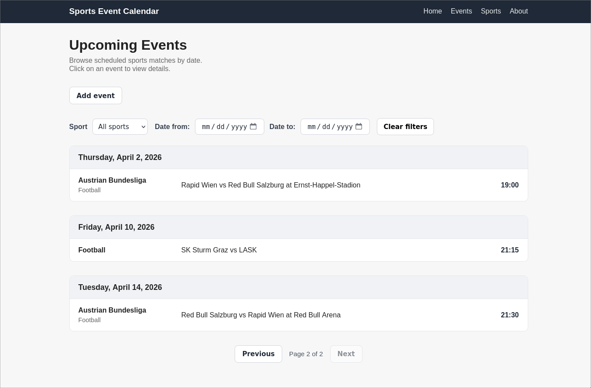
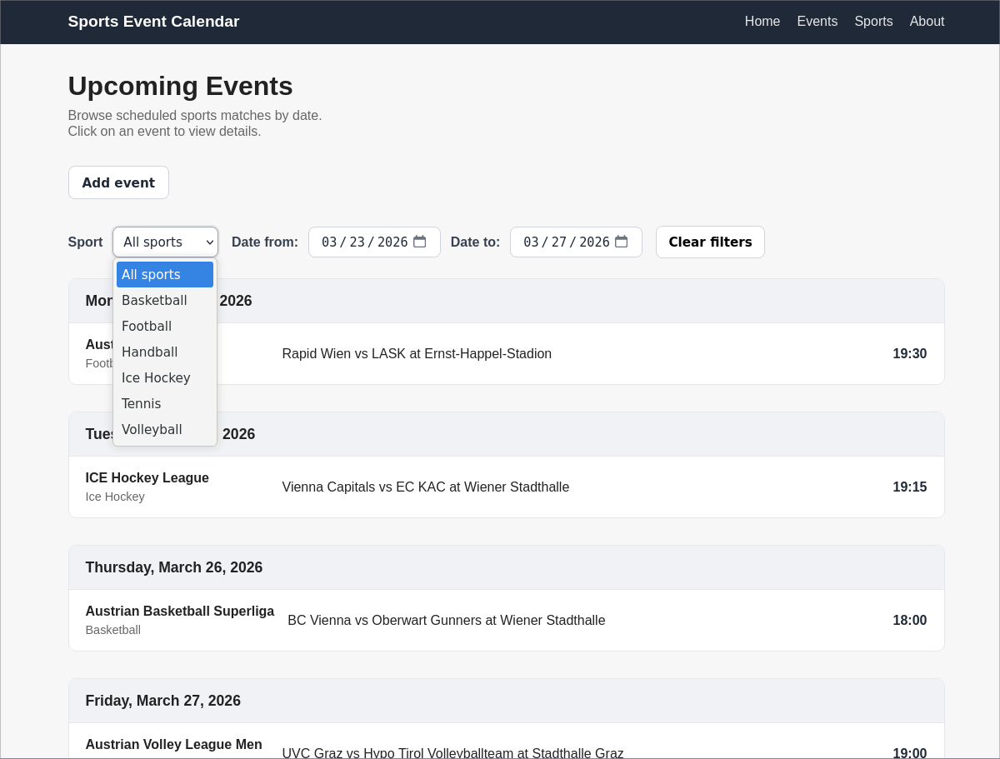
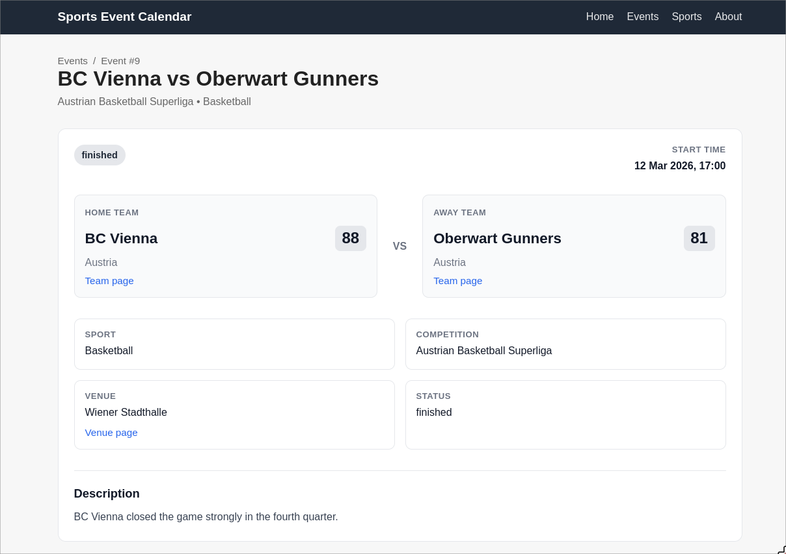

# Sports Event Calendar

A small full-stack web application for managing and browsing sports events,
built as part of the Sportradar Coding Academy Backend Exercise.

## Overview
### Features
The application allows users to:
- browse sports events with pagination and filtering,
- view detailed information about a single event,
- create new events through a simple form (or api),
- fetch related reference data such as sports, teams, competitions, and venues.

### Tech stack
- Go
- PostgreSQL
- HTML
- JavaScript
- CSS
- Docker

## Prerequisites

To run the project locally, you need:

- Docker
- Docker Compose

Optionally, you can also use:

- Make (to run the predefined helper commands from the `Makefile`)

## Setup and run

Before starting the application, create a `.env` file based on the provided example:

```bash
cp .env.example .env
```

### Using Make

Build the Docker images:

```bash
make build
```

Start the database and application containers:

```bash
make up
```

Run database migrations:

```bash
make migrate-up
```

Seed the database with sample data:

```bash
make seed-all
```

Stop all containers:

```bash
make down
```

Useful additional commands:

```bash
make build-run-app
make migrate-down
make migrate-down-all
make logs
make app-logs
make db-shell
```

### Using Docker Compose directly

Build the Docker images:

```bash
docker compose build
```

Start the database and application containers:

```bash
docker compose up -d
```

Run database migrations:

```bash
docker compose run --rm migrations
```

Seed the database with sample data:

```bash
docker compose run --rm migrations /migrate --seed
```

Stop all containers:

```bash
docker compose down
```

### Default local addresses

After starting the application, the main pages are available at:

- Frontend: `http://localhost:8080`
- Health check: `http://localhost:8080/api/v1/healthz`

> Note: migrations and seed data are run manually, so starting the containers alone does not initialize the database schema.

## API endpoints

| Method | Endpoint | Description |
|--------|----------|-------------|
| GET | `/api/v1/healthz` | Health check endpoint |
| GET | `/api/v1/events` | Returns a paginated list of events, with optional filtering |
| GET | `/api/v1/events/{id}` | Returns detailed information about a single event |
| POST | `/api/v1/events` | Creates a new event |
| GET | `/api/v1/sports` | Returns all sports |
| GET | `/api/v1/teams` | Returns all teams |
| GET | `/api/v1/competitions` | Returns all competitions |
| GET | `/api/v1/venues` | Returns all venues |

### `GET /api/v1/events`

Supported query parameters:

| Parameter   | Type | Description | Default |
|-------------|------|-------------|---------|
| `page`      | integer | Page number | `1` |
| `page_size` | integer | Number of items per page | `10` |
| `sport`     | string | Sport slug used for filtering, e.g. `football` | none |
| `date_from` | string | Lower date bound in `YYYY-MM-DD` format | none |
| `date_to`   | string | Upper date bound in `YYYY-MM-DD` format | none |

Notes:
- `page_size` is capped at `50`.
- `date_from` and `date_to` are inclusive from the API user's perspective.
- `sport` is resolved by slug rather than internal ID.

Example:

```http
GET /api/v1/events?page=1&page_size=5&sport=football&date_from=2026-03-22&date_to=2026-03-24
```

## Database design
The application models scheduled sports events with a focus on team sports and single matches/events.  
The database is centered around the `events` table, which connects the main domain entities:
sports, teams, competitions, venues, and countries.

Reference data such as sports and countries is normalized into separate tables,
while events store the match-specific information such as participating teams, start time,
status, score, and optional venue or competition assignment.

This structure keeps the schema relatively small,
while still allowing the application to display meaningful event data and validate domain rules.


## Frontend

The frontend is intentionally simple and focuses on presenting the required functionality clearly.

It includes:
- a homepage with a paginated list of events,
- filtering by sport and date range,
- a detailed event view,
- a simple form for creating new events.

### Screenshots

#### Event list


#### Event filtering


#### Event details


## Assumptions and design decisions
- The application is intentionally scoped to team sports and single scheduled events/matches.
  This keeps the domain model focused and aligned with the core requirements of the exercise.
- The data model is centered around events, with supporting entities such as sports,
  teams, competitions, venues, and countries.
- A more generic model supporting all possible sport types and result formats was intentionally avoided
  in order to keep the project small, consistent, and fully functional within the available time.
- Event filtering was implemented through query parameters (sport, from, to) to keep the API simple and REST-friendly.
- Separate DTOs are used for the event list view and event details view so that list responses
  only return the data needed by the homepage.
- Business validation is implemented on the backend, so the API enforces domain rules regardless of frontend behavior.
  Examples include:
    - home and away teams must be different,
    - both teams and the optional competition must match the selected sport,
    - scheduled events cannot be created in the past,
    - finished events cannot be created in the future.

### Project structure
```text
.
├── cmd/                 # Application entrypoints
├── docs/                # Project documentation assets (ERD)
├── internal/            # Backend application code
│   ├── competition/     # Competition models, repository, handlers
│   ├── database/        # Database connection setup
│   ├── event/           # Event models, repository, service, handlers, errors
│   ├── httpx/           # Shared HTTP / JSON response helpers
│   ├── sport/           # Sport models, repository, handlers
│   ├── team/            # Team models, repository, handlers
│   ├── venue/           # Venue models, repository, handlers
│   └── web/             # Router setup and template rendering
├── migrations/          # SQL migration files (up/down)
├── seeds/               # SQL seed files with sample data
├── web/                 # Frontend templates and static assets
│   ├── static/          # JavaScript and CSS
│   └── templates/       # HTML templates
├── Dockerfile
├── docker-compose.yml
├── Makefile
└── README.md
```
