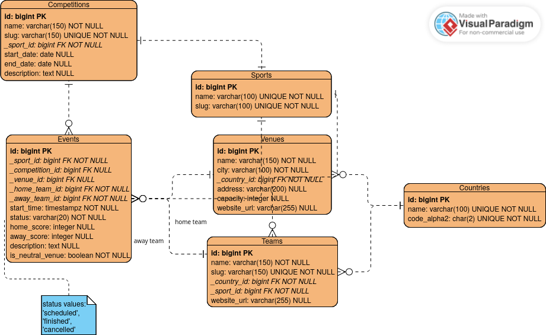

# Sports Event Calendar

This project is a solution for the backend version of Sportradar Coding Academy exercise.
It implements a simple sports event calendar.

## Tech stack
- Go
- PostgreSQL
- Docker

## Database design
The application models scheduled team-sport matches.
Reference data such as sports and countries is normalized into separate tables.



## Running the database

1. Copy `.env.example` to `.env`
2. Start PostgreSQL:
```bash
docker compose up -d